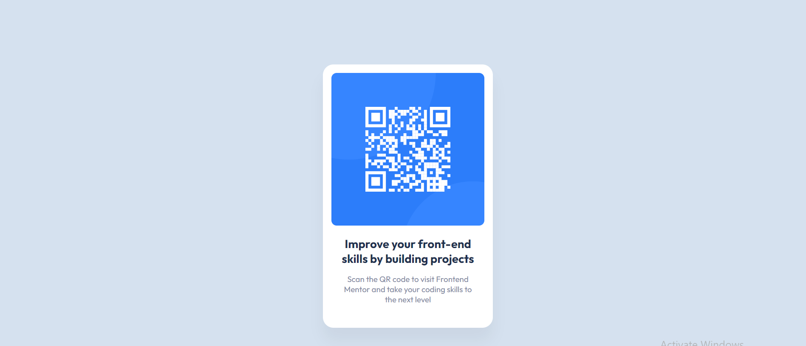

## Table of contents

- [Screenshot](#screenshot)
  - [Links](#links)
- [My process](#my-process)
  - [Built with](#built-with)
  - [What I learned](#what-i-learned)
  - [Continued development](#continued-development)
  - [Useful resources](#useful-resources)
- [Author](#author)

### Screenshot

### Links

- Solution URL: (https://github.com/gabadadzeluca/qr-code-component)

## My process

1. Added html tags.
2. Added font families and css file.
3. Assigned ids to tags
4. Styled css

### Built with

- Semantic HTML5 markup
- CSS custom properties

### What I learned

I learned about position:absolute property in css.  Understund how margins and calc() work. 

### Continued development

I'm not comfortable using position: and display properties in CSS yet.

## Author

-github profile: [https://github.com/gabadadzeluca]
-email: [gabadadzeluca@gmail.com]

**Note: Delete this note and add/remove/edit lines above based on what links you'd like to share.**

## Acknowledgments
